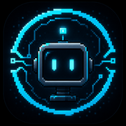

# PROGRAMA

**A sci-fi educational puzzle game that teaches programming concepts through environmental puzzles.**

Built with [Godot Engine](https://godotengine.org/), PROGRAMA drops players into a sci-fi world where progress depends on understanding programming logic — sequencing, conditionals, loops, and variables — expressed as physical, interactive puzzles rather than code editors or quizzes.



---

## 🎮 About the Project

PROGRAMA is a 2D pixel-art puzzle game designed to make programming concepts intuitive by embedding them directly into level design and world mechanics. Instead of writing code, players manipulate the environment to solve puzzles that mirror core programming logic — building intuition before syntax.


## ✨ Features

- 🧩 **Environmental puzzles** that teach programming concepts (sequencing, conditionals, loops, variables) without traditional code syntax
- 🎨 **Pixel-art sci-fi aesthetic**
- 🔊 Custom audio and sound design
- 🛠️ Built entirely in **Godot Engine** using GDScript

> Note: Feature list will expand as gameplay systems are implemented — update this section as mechanics are finalized.

## 📁 Project Structure

```
programa/
├── audio/              # Sound effects and music assets
├── docs/                # Design documents and project notes
├── scenes/              # Godot scenes (levels, UI, entities)
├── sprite/              # Pixel-art sprites and visual assets
├── project.godot        # Godot project configuration
└── default_bus_layout.tres  # Audio bus configuration
```

## 🚀 Getting Started

### Prerequisites

- [Godot Engine](https://godotengine.org/download) (version matching `project.godot` — specify version here once confirmed)

### Running the Project

1. Clone the repository:
   ```bash
   git clone https://github.com/rafikabdallah/programa.git
   ```
2. Open Godot Engine.
3. Click **Import**, select the cloned folder, and open `project.godot`.
4. Press **F5** (or the Play button) to run the project.

## 🗺️ Roadmap

- [ ] Core puzzle mechanics (sequencing, conditionals, loops)
- [ ] Tutorial / onboarding level
- [ ] Additional world zones and progression system
- [ ] Playtesting and balancing
- [ ] Polish pass (audio, visuals, UX)

## 🤝 Contributing

This is currently a solo personal project. Suggestions and feedback are welcome via [Issues](https://github.com/rafikabdallah/programa/issues).


## 👤 Author

**Abdallah Rafik**
- GitHub: [@rafikabdallah](https://github.com/rafikabdallah)

---

*PROGRAMA is a personal project exploring how game design can make abstract programming concepts tangible and intuitive.*
